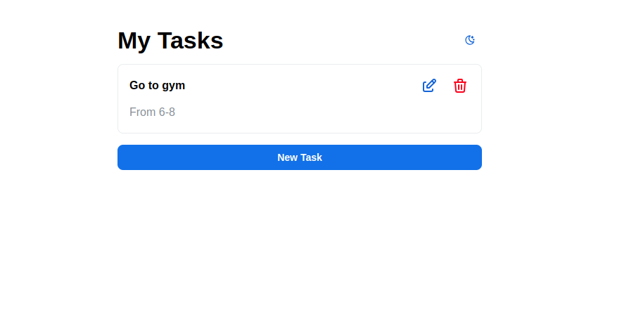
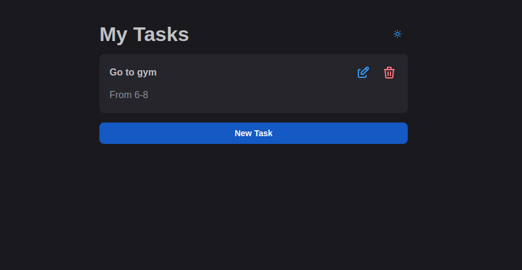

# Task Manager App

A simple and efficient Task Manager application built using React and Mantine. The app allows users to create, edit, and delete tasks, with support for dark and light themes.

## Deployment

The application is deployed and accessible at [Task Manager App](https://todo-app-jainam-b.vercel.app/).

## Features

- **Create new tasks**: Add tasks with a title and summary.
- **Edit tasks**: Update task details with ease.
- **Delete tasks**: Remove tasks that are no longer needed.
- **Persistent storage**: Tasks are saved in local storage.
- **Theme toggle**: Switch between light and dark themes using the keyboard shortcut `Ctrl+J` or `Cmd+J`.

## Screenshots




## Installation

1. **Clone the repository:**
   ```sh
   git clone https://github.com/your-username/task-manager-app.git
   cd task-manager-app
   ```

2. **Install dependencies:**
   ```sh
   npm install
   ```

3. **Start the development server:**
   ```sh
   npm start
   ```

## Usage

1. **Create a new task:** Click on the "New Task" button and fill in the title and summary.
2. **Edit a task:** Click on the edit icon (✏️) next to the task you want to edit.
3. **Delete a task:** Click on the delete icon (🗑️) next to the task you want to delete.
4. **Toggle themes:** Use `Ctrl+J` (Windows/Linux) or `Cmd+J` (Mac) to switch between light and dark themes.

## Project Structure

```
task-manager-app/
├── public/
│   ├── index.html
│   └── ...
├── src/
│   ├── App.jsx
│   ├── index.js
│   ├── ...
├── .gitignore
├── package.json
└── README.md
```

## Contributing

Contributions are welcome! Please follow these steps:

1. Fork the repository.
2. Create a new branch: `git checkout -b my-feature-branch`
3. Make your changes and commit them: `git commit -m 'Add new feature'`
4. Push to the branch: `git push origin my-feature-branch`
5. Create a pull request.

## License

This project is licensed under the MIT License. See the [LICENSE](LICENSE) file for details.

## Acknowledgements

- [Mantine](https://mantine.dev/) for the UI components.
- [Tabler Icons](https://tabler-icons.io/) for the icons.

 
